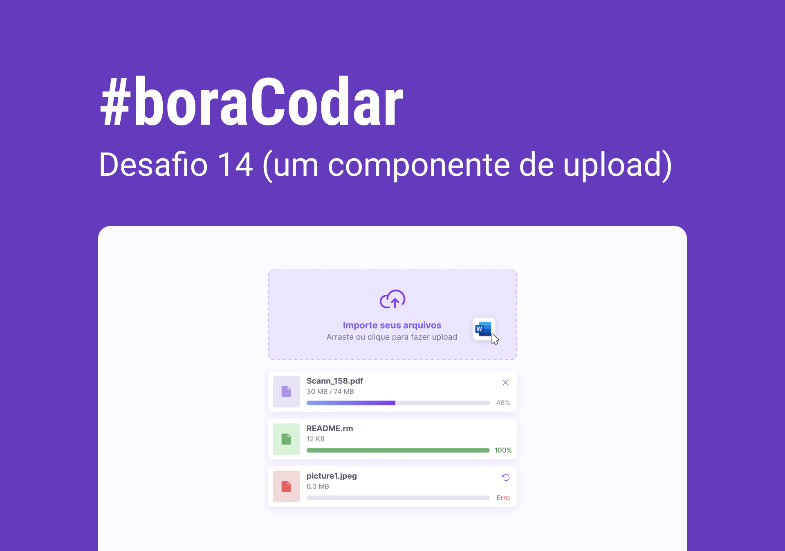

<h1 align="center">BoraCodar#14 - Componente de Upload</h1>

[Deploy](https://williamgrohe.github.io/Bora-Codar/14-upload-component/)

## 🚀 Tecnologias

Esse projeto foi desenvolvido com as seguintes tecnologias:

- HTML
- CSS
- JavaScript

## 💻 Projeto

Este é o projeto de um componente de upload proposto no desafio 14 do [#boraCodar](https://boracodar.dev/) realizado pela [Rocketseat](https://rocketseat.com.br). 

Próximas features:

- [ ] Função para adicionar novos arquivos com suas respectivas informações
- [ ] Remoção de arquivos
- [ ] Adicionar animações
- [ ] Exibição do progresso de carregamento dos arquivos
- [ ] Arquivos podem ser arrastados
- [ ] Efeitos hover e animações
- [ ] Adição de um tema dark
- [ ] Layout responsivo

## 🔖 Layout

Layout original do projeto: [ACESSAR](https://www.figma.com/community/file/1225440656930547927). É necessário ter conta no [Figma](https://figma.com) para acessá-lo.

Made with ❤️ by <a href="https://williamgrohe.github.io/">William Grohe</a>.
